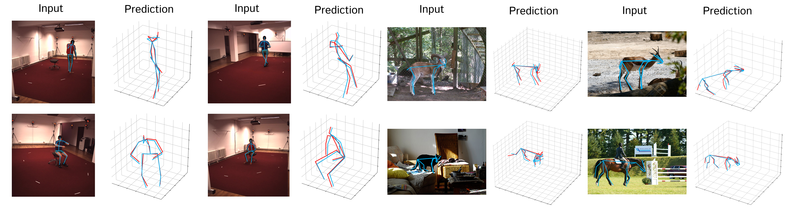
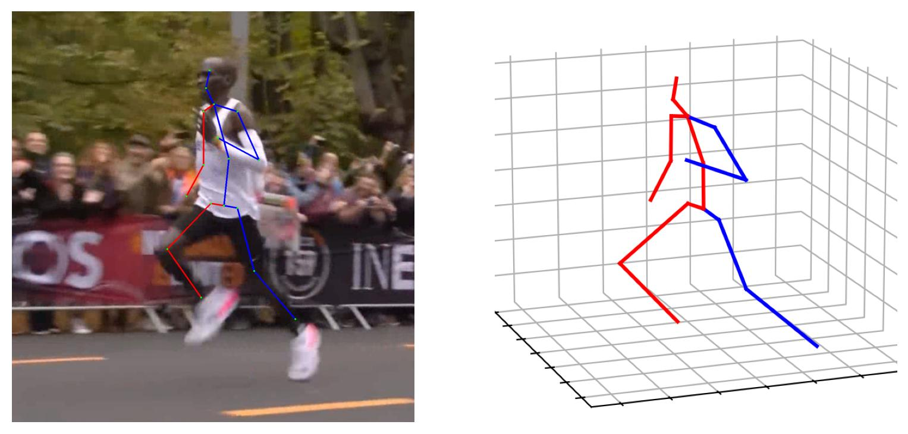

# FMPose3D: monocular 3D pose estimation via flow matching


[](https://badge.fury.io/py/fmpose3d)
[](https://www.gnu.org/licenses/apach2.0)

This is the official implementation of the approach described in the preprint:

[**FMPose3D: monocular 3D pose estimation via flow matching**](http://arxiv.org/abs/2602.05755)            
Ti Wang, Xiaohang Yu, Mackenzie Weygandt Mathis

<!-- <p align="center"></p> -->

<p align="center"></p>

## 🚀 TL;DR

FMPose3D creates a 3D pose from a single 2D image. It leverages fast Flow Matching, generating multiple plausible 3D poses via an ODE in just a few steps, then aggregates them using a reprojection-based Bayesian module (RPEA) for accurate predictions, achieving state-of-the-art results on human and animal 3D pose benchmarks.


## News!

- [X] Feb 2026: the FMPose3D code and our arXiv paper is released - check out the demos here or on our [project page](https://xiu-cs.github.io/FMPose3D/)
- [ ] Planned: This method will be integrated into [DeepLabCut](https://www.mackenziemathislab.org/deeplabcut)

## Installation

### Set up an environment

Make sure you have Python 3.10+. You can set this up with:
```bash
conda create -n fmpose_3d python=3.10
conda activate fmpose_3d

pip install fmpose3d
```

## Demos

### Testing on in-the-wild images (humans)

This visualization script is designed for single-frame based model, allowing you to easily run 3D human pose estimation on any single image.

Before testing, make sure you have the pre-trained model ready.
You may either use the model trained by your own or download ours from [here](https://drive.google.com/drive/folders/1235_UgUQXYZtjprBOv2ZJJHY2KOAS_6p?usp=sharing) and place it in the `./pre_trained_models` directory.

Next, put your test images into folder `demo/images`. Then run the visualization script:
```bash
sh vis_in_the_wild.sh
```
The predictions will be saved to folder `demo/predictions`.

<p align="center"></p>

## Training and Inference

### Dataset Setup

#### Setup from original source 
You can obtain the Human3.6M dataset from the [Human3.6M](http://vision.imar.ro/human3.6m/) website, and then set it up using the instructions provided in [VideoPose3D](https://github.com/facebookresearch/VideoPose3D). 

#### Setup from preprocessed dataset (Recommended)
 You also can access the processed data by downloading it from [here](https://drive.google.com/drive/folders/112GPdRC9IEcwcJRyrLJeYw9_YV4wLdKC?usp=sharing).

Place the downloaded files in the `dataset/` folder of this project:

```
<project_root>/
├── dataset/
│   ├── data_3d_h36m.npz
│   ├── data_2d_h36m_gt.npz
│   └── data_2d_h36m_cpn_ft_h36m_dbb.npz
```

### Training 

The training logs, checkpoints, and related files of each training time will be saved in the './checkpoint' folder.

For training on Human3.6M:
```bash
sh /scripts/FMPose3D_train.sh
```

### Inference

First, download the folder with pre-trained model from [here](https://drive.google.com/drive/folders/1235_UgUQXYZtjprBOv2ZJJHY2KOAS_6p?usp=sharing) and place it in the './pre_trained_models' directory.

To run inference on Human3.6M:

```bash
sh ./scripts/FMPose3D_test.sh
```

## Experiments on non-human animals

For animal training/testing and demo scripts, see [animals/README.md](animals/README.md).

## Citation 

```
@misc{wang2026fmpose3dmonocular3dpose,
      title={FMPose3D: monocular 3D pose estimation via flow matching}, 
      author={Ti Wang and Xiaohang Yu and Mackenzie Weygandt Mathis},
      year={2026},
      eprint={2602.05755},
      archivePrefix={arXiv},
      primaryClass={cs.CV},
      url={https://arxiv.org/abs/2602.05755}, 
}
```

## Acknowledgements

We thank the Swiss National Science Foundation (SNSF Project # 320030-227871) and the Kavli Foundation for providing financial support for this project.

Our code is extended from the following repositories. We thank the authors for releasing the code. 

- [MHFormer](https://github.com/Vegetebird/MHFormer)
- [StridedTransformer-Pose3D](https://github.com/Vegetebird/StridedTransformer-Pose3D)
- [ST-GCN](https://github.com/vanoracai/Exploiting-Spatial-temporal-Relationships-for-3D-Pose-Estimation-via-Graph-Convolutional-Networks)
- [VideoPose3D](https://github.com/facebookresearch/VideoPose3D)
